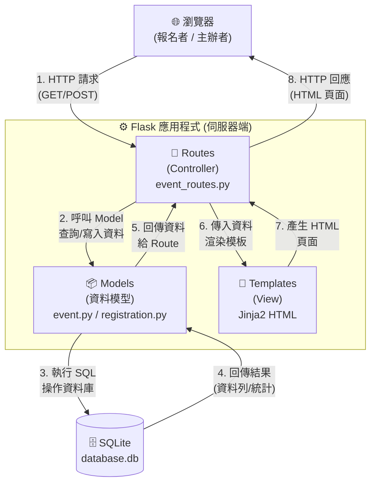
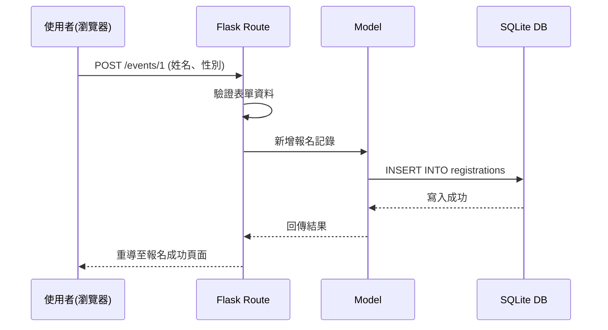

# 系統架構文件（Architecture）— 活動報名系統

## 1. 技術架構說明

### 1.1 選用技術與原因

| 技術            | 用途             | 選用原因                                                     |
| --------------- | ---------------- | ------------------------------------------------------------ |
| Python + Flask  | 後端 Web 框架    | 輕量、易學，適合快速建構 MVP，內建開發伺服器方便測試          |
| Jinja2          | HTML 模板引擎    | Flask 內建，可直接在 HTML 中嵌入 Python 變數，無需前後端分離  |
| SQLite          | 關聯式資料庫     | 不需額外安裝資料庫伺服器，直接產生 `.db` 檔案，適合小型應用   |
| HTML + CSS + JS | 前端頁面         | 基本的網頁技術，搭配 Jinja2 渲染動態內容                     |

### 1.2 Flask MVC 模式說明

本專案採用 MVC（Model-View-Controller）架構模式，各元件職責如下：

```
┌─────────────────────────────────────────────────────┐
│                    MVC 架構                          │
├─────────────┬─────────────────┬─────────────────────┤
│   Model     │   View          │   Controller        │
│  (資料模型)  │  (視圖/模板)     │  (控制器/路由)       │
├─────────────┼─────────────────┼─────────────────────┤
│ app/models/ │ app/templates/  │ app/routes/         │
│             │                 │                     │
│ ‧定義資料表  │ ‧HTML 頁面模板   │ ‧接收 HTTP 請求      │
│  結構       │ ‧顯示活動列表    │ ‧呼叫 Model 處理     │
│ ‧資料庫 CRUD│ ‧報名表單       │  資料               │
│  操作       │ ‧統計數據呈現    │ ‧選擇 View 回應      │
│ ‧統計計算    │                 │  瀏覽器             │
└─────────────┴─────────────────┴─────────────────────┘
```

- **Model（資料模型）**：負責與 SQLite 互動，例如建立活動資料、新增報名者、計算男女人數統計，專注處理資料邏輯。
- **View（視圖 / 模板）**：即 `templates/` 資料夾裡的 Jinja2 HTML 模板。負責呈現活動列表、報名表單、統計數據等畫面，將資料美化呈現給使用者。
- **Controller（控制器 / 路由）**：即 Flask 的路由函式。負責接收瀏覽器的 HTTP 請求（如表單送出），傳給 Model 儲存或查詢，再決定要回應哪一個 View 畫面。

---

## 2. 專案資料夾結構

```text
web_app_development/
│
├── app/                          # 應用程式主要功能資料夾
│   ├── __init__.py              # Flask App 初始化、設定、註冊 Blueprint
│   │
│   ├── models/                  # Model 層：資料庫模型
│   │   ├── __init__.py
│   │   ├── event.py             # 活動（Event）模型 — 建立/查詢活動
│   │   └── registration.py      # 報名（Registration）模型 — 報名/統計
│   │
│   ├── routes/                  # Controller 層：Flask 路由
│   │   ├── __init__.py
│   │   └── event_routes.py      # 活動相關路由（首頁、建立、詳情、報名）
│   │
│   ├── templates/               # View 層：Jinja2 HTML 模板
│   │   ├── base.html            # 共用版型骨架（head、navbar、footer）
│   │   ├── index.html           # 首頁 — 活動列表
│   │   ├── create_event.html    # 建立活動頁面
│   │   ├── event_detail.html    # 活動詳情（報名統計 + 報名表單）
│   │   └── register_success.html # 報名成功確認頁面
│   │
│   └── static/                  # 靜態資源
│       ├── css/
│       │   └── style.css        # 全站樣式表
│       └── js/
│           └── main.js          # 前端互動腳本（表單驗證等）
│
├── instance/                    # 執行期資料（不進版本控制）
│   └── database.db              # SQLite 資料庫檔案（自動生成）
│
├── database/                    # 資料庫設計相關
│   └── schema.sql               # SQL 建表語法
│
├── docs/                        # 專案文件
│   ├── PRD.md                   # 產品需求文件
│   ├── ARCHITECTURE.md          # 系統架構文件（本文件）
│   ├── FLOWCHART.md             # 流程圖
│   ├── DB_DESIGN.md             # 資料庫設計
│   └── ROUTES.md                # 路由設計
│
├── app.py                       # 專案主入口，啟動 Flask 開發伺服器
├── requirements.txt             # Python 套件依賴清單
├── .gitignore                   # Git 忽略規則
└── README.md                    # 專案說明
```

### 各資料夾用途說明

| 資料夾 / 檔案      | 用途                                                         |
| ------------------- | ------------------------------------------------------------ |
| `app/`              | 應用程式核心，包含 Model、View、Controller 三層               |
| `app/models/`       | 定義資料表結構與資料庫操作（CRUD + 統計查詢）                 |
| `app/routes/`       | 定義 URL 路徑與對應的處理邏輯                                 |
| `app/templates/`    | 放置所有 Jinja2 HTML 模板，負責頁面渲染                       |
| `app/static/`       | 放置 CSS、JavaScript、圖片等靜態資源                          |
| `instance/`         | 存放 SQLite 資料庫檔案，不納入版本控制                        |
| `database/`         | 存放 SQL Schema 設計檔案                                      |
| `docs/`             | 存放所有設計文件                                              |
| `app.py`            | 程式進入點，執行此檔案即啟動本地伺服器                        |
| `requirements.txt`  | 記錄所有需要安裝的 Python 套件                                |

---

## 3. 元件關係圖

以下展示使用者操作系統時的資料流與元件互動：



### 請求處理流程範例：報名活動



---

## 4. 關鍵設計決策

### 決策 1：不採用前後端分離，使用 Flask + Jinja2 統一渲染

**原因**：活動報名系統以表單提交與數據展示為主，不需要複雜的前端互動。使用 Jinja2 模板引擎可以省去前端框架的學習成本、API 設計、以及 CORS 跨域問題，讓團隊專注於核心業務邏輯。

### 決策 2：使用 `models/` 資料夾分檔管理 Model

**原因**：將 Event 與 Registration 分開為獨立的 Python 檔案，各自負責一張資料表的操作邏輯，保持程式碼清晰、職責明確，也方便多人分工開發。

### 決策 3：SQLite 資料庫放在 `instance/` 資料夾

**原因**：`instance/` 是 Flask 約定用來存放不進版本控制的執行期資料的位置。將資料庫檔案放在這裡，可以避免報名者個資被推上 GitHub，同時讓不同環境（開發/部署）可以有各自的資料庫。

### 決策 4：統計數據由後端計算（SQL 聚合查詢）

**原因**：男女人數、總人數等統計數據使用 SQL 的 `COUNT` 語法在後端完成計算，而不是把所有報名資料丟給前端用 JavaScript 計算。這樣做的好處是：
- 效能更好（資料庫層級計算比前端迴圈更快）
- 安全性更高（不會把所有報名者個資暴露在前端）

### 決策 5：使用模板繼承減少重複程式碼

**原因**：所有頁面共用 `base.html` 作為版型骨架（包含 `<head>`、導覽列、頁尾），各頁面只需定義自己的內容區塊。這樣修改共用元素（如導覽列）時只需改一個地方，維護成本低。

---

## 5. 頁面與路由對應表

| 頁面             | URL 路徑               | HTTP 方法   | 說明                           |
| ---------------- | ---------------------- | ----------- | ------------------------------ |
| 首頁（活動列表） | `/`                    | GET         | 顯示所有活動清單               |
| 建立活動         | `/events/create`       | GET / POST  | 顯示表單 / 處理建立請求        |
| 活動詳情         | `/events/<id>`         | GET / POST  | 顯示活動資訊與報名表單         |
| 報名成功         | `/events/<id>/success` | GET         | 報名成功確認頁面               |
