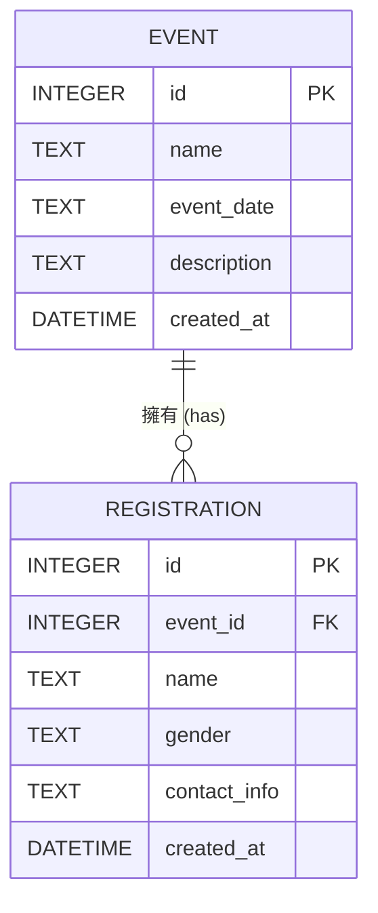

# 資料庫設計文件 (DB Design)

本文件根據功能需求定義系統的資料庫設計，包含實體關係圖 (ER Diagram)、資料表說明，以及各個 Python Model 的介紹。

---

## 1. ER 圖（實體關係圖）



---

## 2. 資料表詳細說明

### 2.1 活動表 (`events`)

儲存活動主辦方所建立的活動基本資訊。

| 欄位名稱 | 型別 | 必填 | 說明 |
| :--- | :--- | :--- | :--- |
| `id` | INTEGER | 是 | Primary Key，自動遞增的活動唯一識別碼 |
| `name` | TEXT | 是 | 活動名稱 |
| `event_date` | TEXT | 是 | 活動日期（建議存為 YYYY-MM-DD 格式） |
| `description` | TEXT | 否 | 活動詳細描述 |
| `created_at` | DATETIME | 是 | 活動建立的時間戳記，預設為當下時間 |

### 2.2 報名表 (`registrations`)

儲存報名者提交的報名資料，與 `events` 表為「多對一」的關係。

| 欄位名稱 | 型別 | 必填 | 說明 |
| :--- | :--- | :--- | :--- |
| `id` | INTEGER | 是 | Primary Key，自動遞增的報名唯一識別碼 |
| `event_id` | INTEGER | 是 | Foreign Key，關聯至 `events.id` |
| `name` | TEXT | 是 | 報名者姓名 |
| `gender` | TEXT | 是 | 性別（男 / 女） |
| `contact_info` | TEXT | 否 | 聯絡資訊（電話或 Email） |
| `created_at` | DATETIME | 是 | 報名建立的時間戳記，預設為當下時間 |

---

## 3. SQL 建表語法

建表語法儲存於 `database/schema.sql` 檔案中，用於初始化 SQLite 資料庫。

```sql
-- database/schema.sql
CREATE TABLE IF NOT EXISTS events (
    id INTEGER PRIMARY KEY AUTOINCREMENT,
    name TEXT NOT NULL,
    event_date TEXT NOT NULL,
    description TEXT,
    created_at DATETIME DEFAULT CURRENT_TIMESTAMP
);

CREATE TABLE IF NOT EXISTS registrations (
    id INTEGER PRIMARY KEY AUTOINCREMENT,
    event_id INTEGER NOT NULL,
    name TEXT NOT NULL,
    gender TEXT NOT NULL,
    contact_info TEXT,
    created_at DATETIME DEFAULT CURRENT_TIMESTAMP,
    FOREIGN KEY (event_id) REFERENCES events(id) ON DELETE CASCADE
);
```

---

## 4. Python Model 程式碼

我們採用 Python 內建的 `sqlite3` 模組來撰寫 Model 層。相關檔案存放於 `app/models/`：

- `app/models/event.py`: 處理活動的建立、查詢等 CRUD 操作。
- `app/models/registration.py`: 處理新增報名，並提供統計男女人數、總人數等查詢方法。
