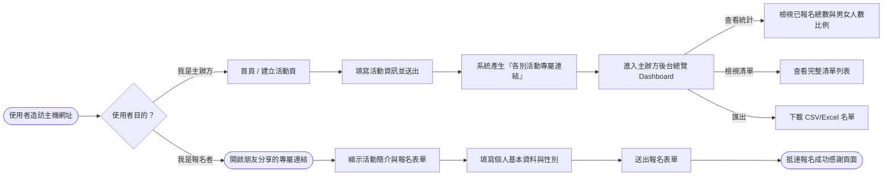

# 流程圖文件 (Flowchart)

本文件根據產品需求文件（PRD）與系統架構文件（ARCHITECTURE），視覺化了「活動報名系統」的使用者操作流程，以及系統內部的資料與狀態流動。

---

## 1. 使用者流程圖（User Flow）

此流程圖分為「主辦方（建立與管理活動）」與「報名者（填寫表單）」兩條主要路徑：



---

## 2. 系統序列圖（Sequence Diagram）

以下序列圖展示了核心情境：**「報名者填寫表單並送出」**時，各個系統元件之間是如何互動與響應的。

```mermaid
sequenceDiagram
    actor Participant as 報名者
    participant Browser as 瀏覽器
    participant Flask as Flask (路線控制器)
    participant Model as Model (資料邏輯層)
    participant DB as SQLite (資料庫)

    Participant->>Browser: 填妥姓名、性別等資料，點擊「確認送出」
    Browser->>Flask: HTTP POST /event/{id}/register (傳送表單內容)
    
    Note over Flask, DB: 後端開始處理
    Flask->>Model: 校驗資料完整性並呼叫「新增報名」函式
    Model->>DB: 執行 SQL: INSERT INTO registrations...
    DB-->>Model: 回傳成功狀態與自動產生的流水號
    
    Note over Model, DB: (若有設定人數上限，亦會檢查目前報名總數)
    Model-->>Flask: 報名手續處理完畢
    
    Flask-->>Browser: HTTP 302 Redirect 重新導向至成功畫面
    Browser-->>Participant: 呈現「您已成功報名！」提示
```

---

## 3. 功能清單對照表

依照 PRD 所需功能轉化為系統實作，下面列出預計會用到的對應網址（URL）與存取方法（HTTP Method）：

| 系統功能 | 說明 | 建議 URL 路徑 | HTTP 方法 |
| :--- | :--- | :--- | :--- |
| **首頁 / 建立活動** | 系統主要入口，主辦方建立活動用 | `/` 或 `/create` | `GET` (看表單)<br>`POST` (送出表單) |
| **填寫報名資料** | 報名者透過連結看到特定活動的表單 | `/event/<event_id>` | `GET` |
| **送出報名處理** | 接收報名者的資料並寫入資料庫 | `/event/<event_id>/register` | `POST` |
| **主辦方後台 ( dashboard )** | 檢視特定活動的人數統計、男女比例圖、名單列表 | `/event/<event_id>/dashboard` | `GET` |
| **匯出報名名單** | 提供主辦方下載目前的名單 CSV 檔案 | `/event/<event_id>/export` | `GET` |

> 註：`<event_id>` 將於建立活動時產生的唯一亂數或編號代碼，確保每個活動有獨立的空間。
