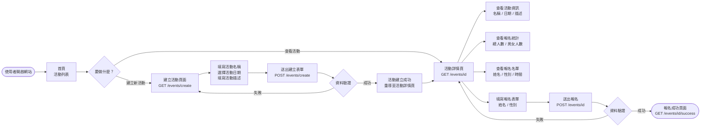
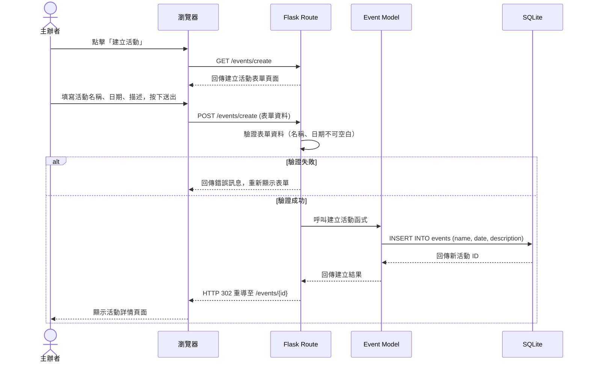
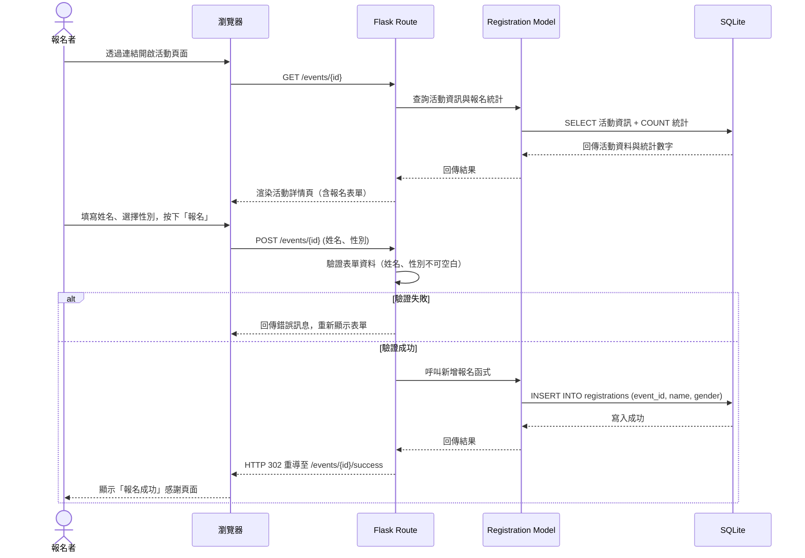
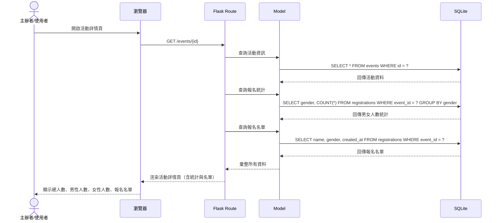

# 流程圖文件（Flowchart）— 活動報名系統

本文件根據 `docs/PRD.md` 與 `docs/ARCHITECTURE.md`，以 Mermaid 語法視覺化「活動報名系統」的使用者操作流程與系統內部資料流動。

---

## 1. 使用者流程圖（User Flow）

此流程圖涵蓋兩條主要路徑：**主辦者（建立活動、查看統計）** 與 **報名者（報名參加活動）**。

### 流程說明

1. **首頁**：所有使用者進入網站後，看到活動列表
2. **建立活動**：主辦者點擊「建立活動」按鈕，填寫活動資訊並送出
3. **活動詳情**：使用者點擊活動或透過分享連結進入，可以查看活動資訊、報名統計，也可以直接報名
4. **報名流程**：填寫姓名與性別後送出，成功後跳轉至感謝頁面

---

## 2. 系統序列圖（Sequence Diagram）

### 2.1 建立活動流程

### 2.2 報名活動流程

### 2.3 查看報名統計流程

---

## 3. 功能清單對照表

以下列出每個功能對應的 URL 路徑與 HTTP 方法：

| 功能             | 說明                                 | URL 路徑               | HTTP 方法   |
| ---------------- | ------------------------------------ | ---------------------- | ----------- |
| 首頁（活動列表） | 顯示所有活動清單，按日期排序         | `/`                    | `GET`       |
| 建立活動頁面     | 顯示建立活動的表單                   | `/events/create`       | `GET`       |
| 建立活動處理     | 接收表單資料，建立新活動             | `/events/create`       | `POST`      |
| 活動詳情頁       | 顯示活動資訊、報名統計、報名表單     | `/events/<id>`         | `GET`       |
| 報名處理         | 接收報名資料，新增報名記錄           | `/events/<id>`         | `POST`      |
| 報名成功頁       | 顯示報名成功的確認訊息               | `/events/<id>/success` | `GET`       |

> **註**：`<id>` 為活動的唯一識別碼（資料庫自動產生的整數 ID）。使用者透過分享的連結（如 `http://localhost:5000/events/3`）即可直接進入特定活動的報名頁面。
